# Hybrid-PQC-RSA-Blockchain-Vulnerable-Lab

Laboratorio diseñado para simular un entorno híbrido de cifrado Post-Quantum (PQC) + RSA dentro de un ecosistema blockchain, con vulnerabilidades intencionales para fines educativos y de investigación.

El objetivo es que los participantes puedan analizar, identificar y explotar fallos en la implementación de esquemas híbridos de cifrado integrados en contratos inteligentes, sin necesidad de montar una infraestructura blockchain compleja.

## Descargar la imagen desde Docker Hub

La imagen está disponible públicamente en Docker Hub y puede descargarse con:

```javascript
docker pull pr00f3xpl0it/hybrid-pqc-rsa-lab:latest
```
## 📜 Descripción del reto

- Contrato inteligente vulnerable que gestiona claves híbridas PQC + RSA.

- FLAG cifrada almacenada on-chain, que puede ser recuperada explotando fallos de diseño.

- Escenario realista para pruebas de auditoría en entornos blockchain con integración de criptografía post-cuántia

## ⚠ Aviso

Este laboratorio NO debe utilizarse en entornos de producción. Está diseñado con vulnerabilidades intencionales y con fines únicamente educativos.

## Flow attack

```mermaid
flowchart TD
    A[Inicio del laboratorio] --> B[Acceso al contrato inteligente vulnerable]
    B --> C[Lectura de claves públicas híbridas PQC + RSA desde la blockchain]
    C --> D[Obtención de FLAG cifrada on-chain]
    D --> E[Análisis del cifrado híbrido y detección de fallo en la implementación PQC]
    E --> F[Derivación de clave simétrica a partir del secreto PQC expuesto]
    F --> G[Descifrado de la FLAG]
    G --> H[FLAG en texto plano]
```



## Contrato Desplegado

```solidity
// SPDX-License-Identifier: MIT
pragma solidity ^0.8.0;

contract HybridKeyVault {
    string public publicKeyPQC;
    string public publicKeyRSA;
    string private encryptedFlag;

    constructor(
        string memory _pqc,
        string memory _rsa,
        string memory _encFlag
    ) {
        publicKeyPQC = _pqc;
        publicKeyRSA = _rsa;
        encryptedFlag = _encFlag;
    }

    function getPublicKeys()
        public
        view
        returns (string memory, string memory)
    {
        return (publicKeyPQC, publicKeyRSA);
    }

    function getEncryptedFlag() public view returns (string memory) {
        return encryptedFlag;
    }
}
```
## Generacion de llaves.

```python
#!/usr/bin/env python3
import os, base64
from Crypto.PublicKey import RSA
from Crypto.Cipher import PKCS1_OAEP

secret = os.urandom(32)

pqc_pub = secret

rsa_key = RSA.generate(2048)
rsa_pub = rsa_key.publickey().export_key()
rsa_priv = rsa_key.export_key()

rsa_cipher = PKCS1_OAEP.new(RSA.import_key(rsa_pub))
ct_rsa = rsa_cipher.encrypt(secret)
```
---
## Creditos

- Desarrollado por [**HackSyndicate**](https://www.hacksyndicate.xyz)  
- Coordinado por [**Mauro Carrillo (Pr00f)**](https://www.linkedin.com/in/mauro-carrillo-7a326a208)
